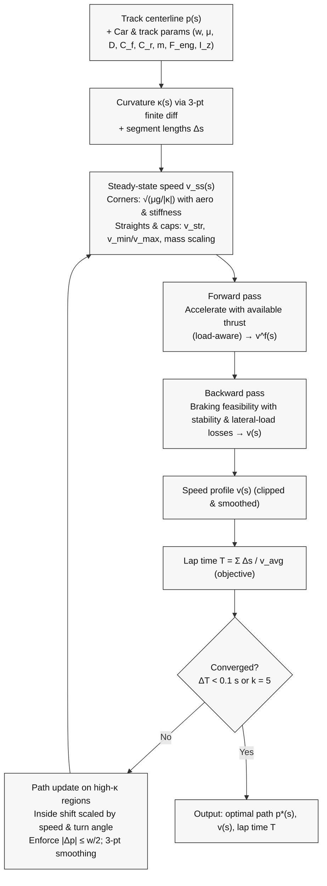
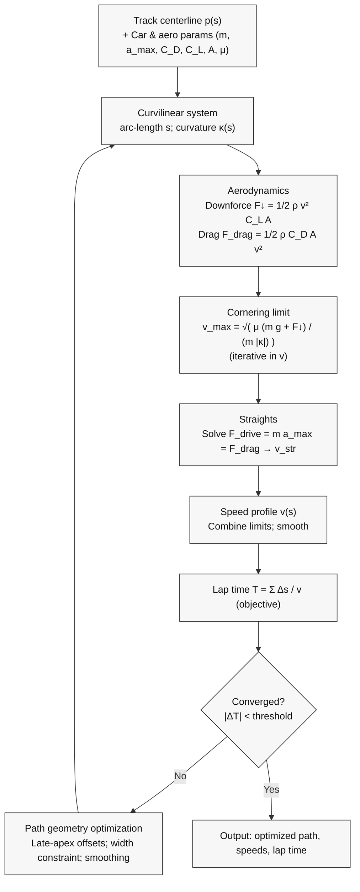

# Poster Assets & Methodology

This folder contains poster assets and scripts. Below is the Kapania Two‑Step Algorithm flow (Mermaid) that you can paste in documentation or export. For Figma/Canva, you can also export equations as SVGs.

## Kapania Two‑Step Flow



### Notes for labels (tiny text box on poster)
- κ(s): curvature from three‑point finite difference
- v_ss(s): steady‑state corner/straight limits with aero and stiffness
- Forward/backward: integrate acceleration/braking per segment with parameter losses
- Path update: shift toward inside in high‑curvature regions, respect |Δp|≤w/2, smooth
- Stop when lap‑time improvement < 0.1 s or after 5 iterations

### Export equations as SVG
Run:

```
python3 Backend/tests/export_kapania_equations_svg.py
```

SVGs will be written to `Backend/tests/poster_output/equations/` with transparent backgrounds.

## Physics‑Based Model Flow



### Export physics equations as SVG
Run:

```
python3 Backend/tests/export_physics_equations_svg.py
```

SVGs will be written to `Backend/tests/poster_output/equations/`.

 