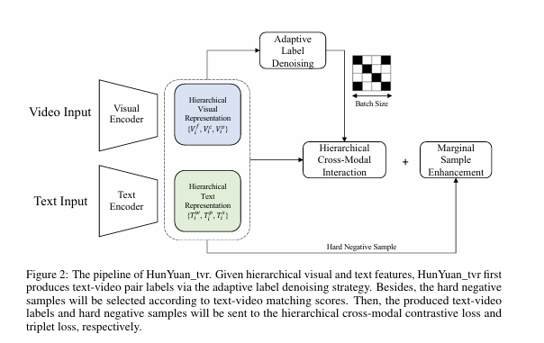
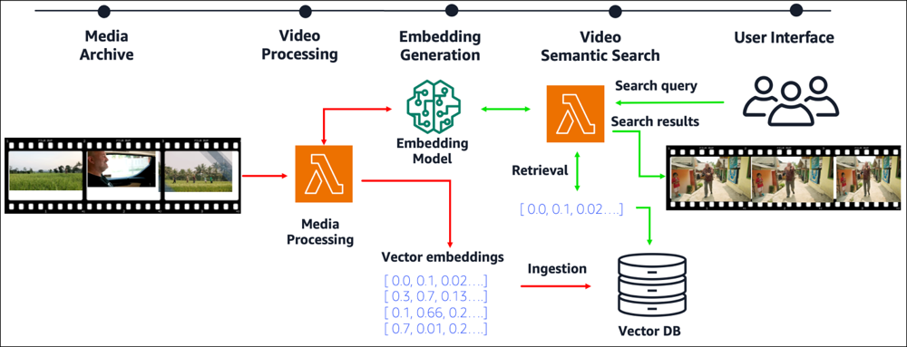
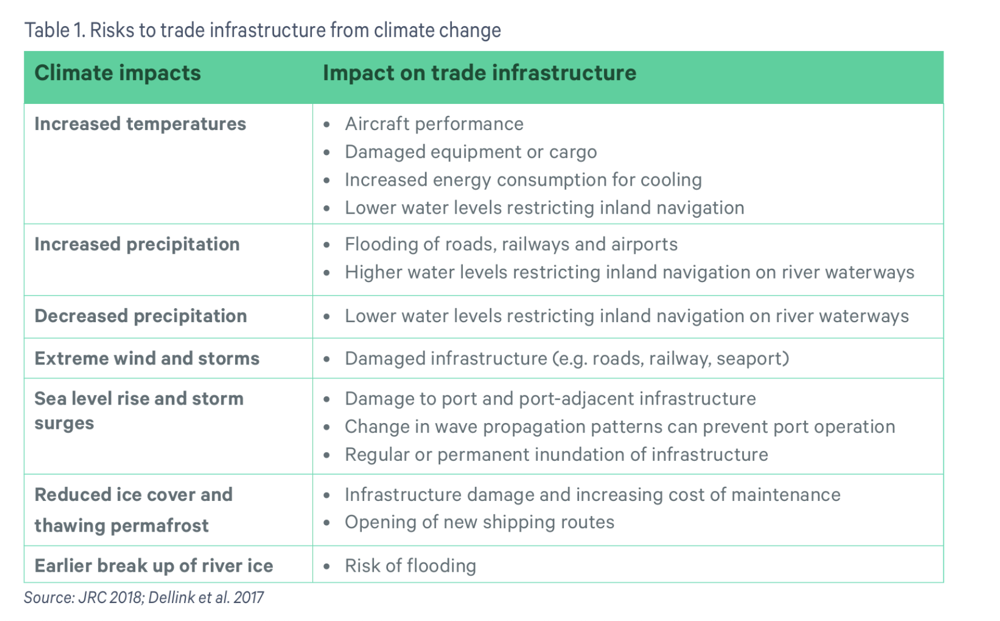
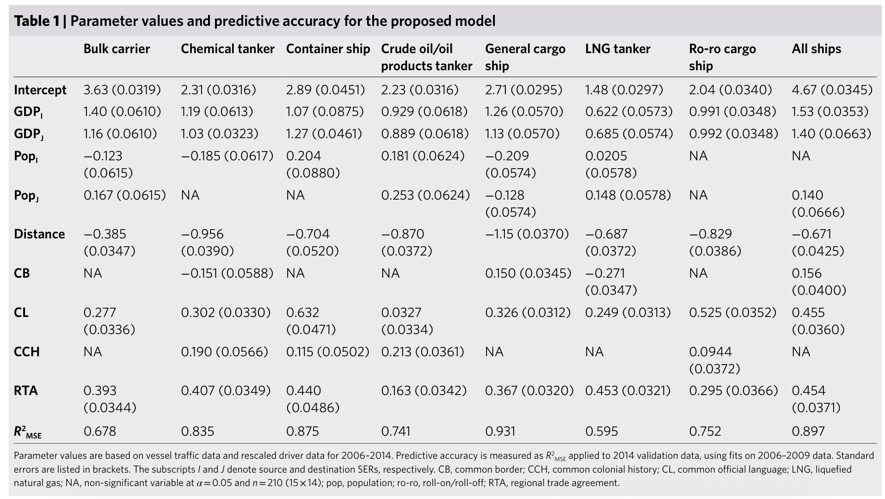

# Project Proposal

## 1. Video indexing/searching with the help of Multimodal AI

### Creating Searchable Videos

**Pain Point** - Searching for videos is usually constrained only to the descriptions of the text-based descriptions videos/timestamp descriptions. Additionally, looking for a specific frame, that a user can verbally describe is usually not possible.

**Methodology**
The videos are not time stamped by the uploader(as seen on youtube) AI learns the context of the video and saves some info about a particialr frame so that when a user searches for something the AI can then fetch the indexed hash that matched the search description and shows the time stamp from where in the video a particular scene actually starts or the info the user has asked starts.

**Example**
User types - Slow motion video of a man shooting prince Rupert's drop
results - smartereveryday channel's video on prince Rupert's drop

*How will this learn context from a video* - need to look into researches that are being done on this to see if there are papers written on extracting context from a video maybe going frame by frame or processing the whole video at one go.

**Resources and Research Available**

1. **https://arxiv.org/pdf/2204.03382v6#:~:text=clip,and** refers to  a Vision Language Retrieval Model.

2. **https://www.amazon.science/publications/audio-enhanced-text-to-video-retrieval-using-text-conditioned-feature-alignment#:~:text=separately,conditioned%20audio%20representation** Combining both textual and audio fusion to generate a complete understanding of a scene.

3. **https://openreview.net/forum?id=elDjJp4Upl&noteId=elDjJp4Upl** - AVHash is a tri-level Transformer-based architecture designed to generate compact binary representations (hash codes) of videos by jointly modeling their audio and visual content.

**Goal**

The goal of the project would be to create software that is able to index your video and search for it using multi-modal AI - VLR models.

## 2. Weather pattern modelling to predict next 15-20 days of weather and suggest optimized routes for high priority goods(grains, food raw materians, medical equipments, drugs) to be imported/exported via air or water in such a way that it takes less time and fuel(inter continental logistics)

Weather pattern changes as told by Prof. James in his class for uncertainty quantification are very chaotic and unpredictable, so we will tackle that (doesn't need to be super accurate just enough to predict with good accuracy for the future)

With this done let us say Fedex wants to deliver a package from Dublin to India in optimal time with optimal route.
What we suggest from the weather pattern changes are what routes will be optimal(just like Google maps does on a local level) but we suggest travel time by air, sea and which is efficient in terms of time, money and fuel.

*Resources and research papers*

1. **https://www.gtap.agecon.purdue.edu/** - The Global Trade Analysis Project (GTAP) is a global network of researchers and policy makers conducting quantitative analysis of international policy issues. GTAP is coordinated by the Center for Global Trade Analysis in Purdue University's Department of Agricultural Economics.
The database is not free, we need to look into other data sources

2. **https://www.sei.org/wp-content/uploads/2023/12/sei2023.064-climate-trade-infrastructure.pdf** -  Report on the impact and risks that arise from climate change in the trade routes and infrastructure. In this report they talk aboiut variuos factros that affect land, air and sea trading infra and what measures can be take to fix these

3. **https://www.researchgate.net/publication/390627443_Logistics_in_the_era_of_climate_change_a_review_of_challenges_and_development_opportunities** - This article analyzes impact of climate change on the logistics sector and identifies key challenges and opportunities for development in the context of sustainable development.

4. **https://www.researchgate.net/publication/389140448_Weather-Related_Disruptions_in_Transportation_and_Logistics_A_Systematic_Literature_Review_and_a_Policy_Implementation_Roadmap** - This is a literature review on the increasing severity of extreme  weather and its impact on transport and logistics sector 

5. **https://leung-lab.github.io/leunglab/articles/Sardain_et_al_Nature_Sust_2019.pdf** - Socioeconomic factors like population growth, global trade, and material transport interact with environmental influences to shape the sustainability of natural ecosystems. This study focuses on the global shipping network, a key driver in the spread of invasive species. Using basic socioeconomic indicators and a temporal validation set, the model accounts for 90% of global shipping traffic variation and predicts a doubling of shipping activity. When combined with economic growth scenarios, projections show maritime traffic could rise by 240–1,209% by 2050. The analysis also indicates that shipping, more than climate change, will significantly elevate the risk of biological invasions—particularly in middle-income regions such as Northeast Asia—potentially increasing invasion risk by 3 to 20 times.

    This one has various  data  sources and the results of their model that they ran

## 3. Epidemiological forecasting for SARS like viruses

Epidemiological forecasting, also known as epi-forecasting, is the process of predicting the future course of a disease or health condition within a population, often using mathematical models and statistical analysis. It helps understand disease dynamics and market trends, enabling informed decision-making for public health, commercial institutions, and the general public. 

*Resources and research papers*

1. **https://pmc.ncbi.nlm.nih.gov/articles/PMC7116954/** - 
In this work we propose a simple mathematical model for the analysis of the impact of control measures against an emerging infection, namely, the severe acute respiratory syndrome (SARS). The model provides a testable hypothesis by considering a dynamical equation for the contact parameter, which drops exponentially with time, simulating control measures. We discuss the role of modelling in public health and we analyse the distinction between forecasting and projection models as assessing tools for the estimation of the impact of intervention strategies. The model is applied to the communities of Hong Kong and Toronto (Canada) and it mimics those epidemics with fairly good accuracy. The estimated values for the basic reproduction number, R0, were 1.2 for Hong Kong and 1.32 for Toronto (Canada). The model projects that, in the absence of control, the final number of cases would be 320,000 in Hong Kong and 36,900 in Toronto (Canada). In contrast, with control measures, which reduce the contact rate to about 25% of its initial value, the expected final number of cases is reduced to 1778 in Hong Kong and 226 in Toronto (Canada). Although SARS can be a devastating infection, early recognition, prompt isolation, and appropriate precaution measures, can be very effective to limit its spread.

2. **https://arxiv.org/html/2307.01157** - 
This paper proposes a novel approach to predict epidemiological parameters by integrating new real-time signals from various sources of information, such as novel social media-based population density maps and Air Quality data. We implement an ensemble of Convolutional Neural Networks (CNN) models using various data sources and fusion methodology to build robust predictions and simulate several dynamic parameters that could improve the decision-making process for policymakers. Additionally, we used data assimilation to estimate the state of our system from fused CNN predictions. The combination of meteorological signals and social media-based population density maps improved the performance and flexibility of our prediction of the COVID-19 outbreak in London. While the proposed approach outperforms standard models, such as compartmental models traditionally used in disease forecasting (SEIR), generating robust and consistent predictions allows us to increase the stability of our model while increasing its accuracy.

3. **https://cmu-delphi.github.io/delphi-tooling-book/**  - 
This is a book we can refer to for more reading and feature selections, this has code examples too.
Catution!!!!!! - This book is still under progress an dthings may change over time as per updates in the field.

4. **https://www.sciencedirect.com/science/article/pii/S1571064524001350** - 
This one does a modeling and feature selections based on BIC and error analysis for a model they prepared for Covid data.

5. **https://researchonline.lshtm.ac.uk/4664035/1/epidimiological%20vs%20meterological%20forecasts%20and%20risk%20assesments.pdf** - 
This one relates weather changing patterns to epidemiological forecasting, an interesting take.

6. **https://royalsocietypublishing.org/doi/10.1098/rsta.2021.0305** - This uses SIR model that we did for Uncertainty Quantification so we are somewhat familiar with the working and we can emulate these or maybe create one of our own SIR model.

**Note** -- The data need to be good and let us see if we can take data from vilrology department of UCD to ease our work onn data collection.

## 4. Mathematical Modelling of Optimized Paths in a Race Track

The race line is often dependent on several factors like track temperatures, friction, tyre - type (medium), Torque etc.

Use these various factors in math modeling to create an optimized race line.

*Resources and research papers*

1. **https://sci-hub.se/10.1007/BF03246771** - 
This article presents a tool for optimising the driving line on a given race track, determined from
a number of possible lines by applying a combination of several optimisation techniques in order
to minimize lap time. It examines the interdependencies between vehicle and track parameters.
Various types of cars and sets of parameters require significantly different trajectories. These can
be used as input for lap time simulations, allowing real driving lines to be evaluated.

2. **https://dspace.mit.edu/bitstream/handle/1721.1/64669/706825301-MIT.pdf** - 
This paper addresses the challenge of selecting optimal racing lines, a key factor in high-level car racing that is typically guided by driver intuition. It explores four methods—Euler spiral, artificial intelligence, nonlinear programming, and an integrated approach—to compute optimal paths based on track geometry and vehicle dynamics. The AI method is highlighted for its effectiveness on both 2D and 3D tracks. Each method is evaluated for speed, accuracy, and practicality, with visualization tools developed to aid analysis. The findings have broader applications in sports like cycling, ice skating, and skiing.

3. **https://www.tandfonline.com/doi/full/10.1080/00423110903514236**

A numerical method for the time-optimal control of the race car is presented. The method is then used to perform the role of the driver in numerical simulations of manoeuvres at the limit of race car performance. The method does not attempt to model the driver but rather replaces the driver with methods normally associated with numerical optimal control. The method simultaneously finds the optimal driven line and the driver control inputs (steer, throttle and brake) to drive this line in minimum time. In principle, the method is capable of operation with arbitrarily complex vehicle models as it requires only limited access to the vehicle model state vector. It also requires solution of the differential equation representing the vehicle model in only the forward time direction and is hence capable of simulating the full vehicle transient response.

4. **https://www.sciencedirect.com/science/article/abs/pii/S0045794908000163** - 
This paper focuses on minimizing lap time by finding the optimal racing trajectory that balances shortest distance and highest possible speed. It treats trajectory planning as a bounded optimization problem influenced by both track geometry and vehicle dynamics. A simplified vehicle model is used to account for speed-dependent acceleration, deceleration, and lateral forces. Once the optimal trajectory and speed profile are found, driver inputs are modeled as control actions to follow the path, though dynamic feedback between driver and vehicle is not considered.

5. 3. **https://etheses.whiterose.ac.uk/id/eprint/32528/1/Lambert_ED_Transport_PhD_2023.pdf** - 
This thesis tackles large-scale, conflict-free path planning for autonomous vehicles in warehouse environments shared with humans. It breaks down the problem into shortest-path planning, local obstacle avoidance using clothoid curves, and zone-based intersection management. A novel approximation method and messaging interface ensure smooth coordination across zones. Simulations showed effective performance, especially with added boundary constraints that enabled seamless vehicle transitions across intersections without backups.

