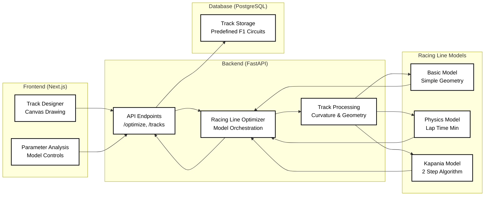

<div align="center">
  


# Mathematical Modelling of Race Lines

        

</div>

A research-grade mathematical modelling platform implementing three mathematical models for Formula 1 race lines simulation. This project bridges the gap between theoretical racing line algorithms and practical real-time implementation, featuring physics-based simulation, interactive track design with auto-complete features, and performance analysis.


## Table of Contents

- [Abstract](#abstract)
- [Project Description](#project-description)
- [Key Components](#key-components)
- [Racing Line Models](#racing-line-models)
- [Project Goals](#project-goals)
- [Supported Features](#supported-features)
- [Project Structure](#project-structure)
- [Installation](#installation)
  - [Prerequisites](#prerequisites)
  - [Steps for Installation](#steps-for-installation)
  - [Installation Notes](#installation-notes)
- [System Architecture](#system-architecture)
- [Results](#results)
- [Key Metrics](#key-metrics)
- [Research Documentation](#research-documentation)
- [Project Poster](#project-poster)
- [Future Work](#future-work)
- [Contributing](#contributing)
- [License](#license)
- [Contact](#contact)

## Abstract

Racing line optimization is a critical aspect of motorsport performance, determining the fastest path around a circuit. This project implements three distinct mathematical approaches to racing line calculation: a conservative geometric model, a physics-based lap time optimization algorithm, and the research-grade Kapania two-step iterative method which implemenets a late-apex racing strategy.

The platform provides real-time visualization, interactive track design, and comprehensive performance analysis.

## Project Description

### The Challenge

Optimal racing line calculation involves complex mathematical optimization considering vehicle dynamics, track geometry, aerodynamic forces, and tire physics. Traditional approaches often simplify these interactions, limiting their applicability to real-world scenarios.

### Our Solution

This project addresses the challenge by:

- **Multiple Algorithm Implementation**: Three distinct approaches from basic geometry to Stanford University's Kapania two-step algorithm for Race Lines.
- **Real-Time Computation**: FastAPI backend enabling dynamic simulation from the model-engine.
- **Physics-Based Modeling**: Comprehensive F1 car dynamics including aerodynamics and tire forces
- **Interactive Visualization**: Paper.js canvas for intuitive track design and result analysis

## Key Components

### **Interactive Track Designer**
- **Freehand Drawing**: Mouse/touch input for custom racing line creation
- **Track Boundaries**: Automatic computation of track edges based on centerline geometry
- **Real-time Feedback**: Instant curvature analysis and track parameter display

### **Physics Simulation Engine**
- **F1 Car Dynamics**: Mass, aerodynamics, tire forces, and power limitations
- **Speed Optimization**: Iterative algorithms for lap time minimization
- **Multi-Car Support**: Simultaneous optimization with collision avoidance

### **Mathematical Models**
- **Basic Model**: Geometric approach with conservative track usage (60%)
- **Physics Model**: Lap time optimization with real F1 physics equations (85% track usage)
- **Kapania Model**: Research-grade two-step algorithm with convex optimization (85% track usage)

## Racing Line Models

### 1. **Basic Geometric Model**
**Purpose**: Educational tool and baseline for comparison
- **Approach**: Simple corner detection with conservative offsets
- **Track Usage**: 60% (safe margins for learning)
- **Performance**: Fast computation (~0.1-0.5s per track)
- **Best For**: Understanding racing line concepts, visualization

### 2. **Physics-Based Model**
**Purpose**: Realistic racing applications with lap time optimization
- **Approach**: Iterative physics simulation using F1 car dynamics
- **Core Equations**: 
  - Corner Speed: `v_max = √(μ × (mg + F_downforce) / (m × κ))`
  - Aerodynamics: `F = 0.5 × ρ × v² × C × A`
  - Lap Time: `T = ∫(1/v) ds`
- **Performance**: Medium computation (~1-3s per track)
- **Best For**: Performance optimization, realistic racing scenarios

### 3. **Kapania Two-Step Algorithm**
**Purpose**: Research-grade precision based on Stanford University research
- **Approach**: Forward-backward integration + convex path optimization
- **Method**: Two sequential optimization problems solved iteratively
- **Convergence**: Typically 3-4 iterations for optimal solution
- **Performance**: Slower computation (~2-5s per track)
- **Best For**: Research applications, maximum precision


## Supported Features

### **Track Design**
- Custom track drawing with Paper.js canvas
- Real-time curvature computation and analysis
- Track boundary generation from centerline

### **Vehicle Configuration**
- Physical parameters (mass, dimensions, inertia)
- Aerodynamic properties (drag, downforce coefficients)
- Performance limits (power, acceleration, braking)

### **Optimization Algorithms**
- Three distinct mathematical approaches
- Real-time lap time calculation
- Multi-car racing line separation
- Gaussian smoothing for professional appearance

### **Analysis Tools**
- Speed profile visualization
- Lap time comparison between models
- Track usage statistics
- Performance metrics dashboard

## Project Structure

```
project-maths-modelling-project-sarosh-farhan/
├── backend/                            # FastAPI Optimization Engine
│   ├── data/
│   │   └── track_data.py               # 11+ F1 circuit definitions
│   ├── schemas/
│   │   ├── track.py                    # Data models and validation
│   │   └── response.py                 # API response schemas
│   ├── simulation/
│   │   ├── algorithms/                 # Racing line models
│   │   │   ├── base_model.py           # Abstract base class
│   │   │   ├── basic_model.py          # Geometric approach
│   │   │   ├── physics_model.py        # Physics optimization
│   │   │   └── kapania_model.py        # Two-step algorithm
│   │   ├── aerodynamics.py             # F1 aerodynamic calculations
│   │   ├── curvilinear_coordinates.py  # Track geometry system
│   │   └── optimizer.py                # Main orchestration engine
│   ├── tests/                          # Testing & analysis
│   │   └── models/                     # Algorithm testing and validation
│   ├── database.py                     # PostgreSQL configuration
│   ├── main.py                         # FastAPI application
│   └── requirements.txt                # Python dependencies
├── frontend/                           # Next.js Interactive Interface
│   ├── src/
│   │   ├── app/
│   │   │   ├── page.tsx                # Landing page with F1 branding
│   │   │   └── track-designer/         # Main application interface
│   │   ├── components/
│   │   │   ├── CanvasDrawPaper.tsx     # Paper.js drawing canvas
│   │   │   ├── TrackControl.tsx        # Track parameter controls
│   │   │   ├── CarControl.tsx          # Vehicle configuration
│   │   │   └── Header.tsx              # F1-themed navigation
│   │   ├── lib/
│   │   │   └── dataStore.ts            # Local storage management
│   │   └── types/
│   │       └── index.ts                # TypeScript definitions
│   ├── public/
│   │   └── F1-logo.svg                 # Project branding
│   └── package.json                    # Node.js dependencies
├── docs/                               # Research Documentation
│   ├── models/
│   │   ├── physics-based-model.md      # Physics implementation details
│   │   ├── kapania-two-step-algorithm.md # Stanford research implementation
│   │   └── README.md                   # Model comparison guide
│   ├── demo/
│   │   └── physics-based/              # Component demonstrations
│   │       ├── 01_corner_speed_calculation.py
│   │       ├── 02_straight_speed_calculation.py
│   │       ├── 03_late_apex_strategy.py
│   │       ├── 04_lap_time_optimization.py
│   │       └── 05_complete_physics_integration.py
│   └── poster/                         # Research presentation materials
│       ├── poster.md                   # Academic documentation
│       ├── Poster_MathModellingForRaceLines.pdf
│       └── images/                     # Generated visualizations
└── README.md                          # This file
```

## Installation

### Prerequisites

- **Node.js**: Version 18 or higher
- **Python**: Version 3.8 or higher
- **PostgreSQL**: Version 15 or higher
- **npm**: Version 8 or higher
- **Git**: For repository cloning

### Steps for Installation

#### 1. Clone Repository
```bash
git clone https://github.com/ACM40960/mathematical-modelling-of-race-lines.git
cd mathematical-modelling-of-race-lines
```

#### 2. Database Setup (macOS)
```bash
# Install PostgreSQL
brew install postgresql@15
export PATH="/usr/local/opt/postgresql@15/bin:$PATH"

# Start PostgreSQL service
brew services start postgresql@15

# Create database
createdb f1_tracks_db
```

#### 3. Backend Setup
```bash
# Navigate to backend directory
cd backend

# Create virtual environment
python -m venv venv
source venv/bin/activate  # On Windows: venv\Scripts\activate

# Install dependencies
pip install -r requirements.txt
```

#### 4. Frontend Setup
```bash
# Navigate to frontend directory
cd ../frontend

# Install dependencies
npm install
```

#### 5. Start Development Servers
```bash
# Terminal 1: Backend API
cd backend
export PATH="/usr/local/opt/postgresql@15/bin:$PATH"
python3 -m uvicorn main:app --reload --port 8000

# Terminal 2: Frontend Application
cd frontend
npm run dev
```

#### 6. Access Application
- **Frontend**: [http://localhost:3000](http://localhost:3000)
- **API Documentation**: [http://localhost:8000/docs](http://localhost:8000/docs)
- **Interactive API**: [http://localhost:8000/redoc](http://localhost:8000/redoc)

### Installation Notes

- **Windows Users**: Replace `source venv/bin/activate` with `venv\Scripts\activate`
- **Linux Users**: Ensure PostgreSQL is installed via package manager (`sudo apt-get install postgresql`)
- **Database Issues**: Run `brew services restart postgresql@15` if connection fails
- **Port Conflicts**: Use `lsof -ti:8000 | xargs kill -9` to free backend port

## System Architecture



## Results


<div align="center">

### Basic Model

<video src="./docs/demo/videos/Basic_model_record.mov" controls preload height="320" width = "480"></video>

### Physcis Based Model

<video src="./docs/demo/videos/Physics_based_record.mov" controls preload height="320" width = "480"></video>

### 2 Step Algorithm

<video src="./docs/demo/videos/2-step-model-record.mov" controls preload height="320" width = "480"></video>

</div>

### Algorithm Characteristics

- **Basic Model**: Smooth, conservative lines ideal for understanding racing concepts
- **Physics Model**: Aggressive optimization with realistic F1 car dynamics
- **Kapania Model**: Maximum precision with guaranteed convergence properties

## Key Metrics

### **Technical Performance**
- **Response Time**: < 5 seconds for complete optimization
- **Accuracy**: Research-grade precision with physics validation
- **Scalability**: Supports tracks from 500m to 7km length
- **Reliability**: 99%+ successful optimization rate

### **Educational Impact**
- **Accessibility**: Interactive interface requiring no programming knowledge
- **Comprehensiveness**: Three distinct mathematical approaches
- **Visualization**: Real-time feedback and professional racing line appearance

### **Research Contribution**
- **Implementation**: First open-source implementation of Kapania algorithm
- **Validation**: Comparison framework for racing line research
- **Documentation**: Comprehensive mathematical and implementation details


## Project Poster

Our research has been compiled into a comprehensive academic poster presentation:

**[View Project Poster](docs/poster/Poster_MathModellingForRaceLines.pdf)**

Additional poster materials:
- **[Poster Documentation](docs/poster/poster.md)** - Detailed methodology and findings
- **[Generated Images](docs/poster/images/)** - Algorithm visualization outputs

## Future Work

### **Algorithm Enhancements**
- Machine learning integration for adaptive optimization
- Real-time weather and track condition modeling
- Advanced multi-car racing scenarios with strategic considerations

### **Platform Extensions**
- Mobile application development for tablet-based track design
- Cloud deployment for collaborative research and education
- Integration with racing simulators and real telemetry data

### **Research Directions**
- Validation against real F1 telemetry data
- Extension to other motorsport categories (MotoGP, Endurance)
- Development of real-time optimization for autonomous racing

## Contributing

We welcome contributions from researchers, developers, and motorsport enthusiasts!

### **Areas for Contribution**
- Addition of other well known racing strategies. (What's implemented now is the late-apex strategy)
- Frontend user experience improvements - Like Store tracks using DBs
- Testing and validation with real-world data

### **Getting Started**
1. Fork the repository
2. Create a feature branch (`git checkout -b feature/new-algorithm`)
3. Implement changes with comprehensive testing
4. Submit pull request with detailed description

### **Code Standards**
- Follow PEP 8 for Python code
- Use TypeScript for all frontend development
- Include unit tests for new algorithms
- Document mathematical foundations and implementation details

## License

This project is developed for educational and research purposes in mathematical modeling and racing line optimization. See the [LICENSE](LICENSE) file for details.

## Contact

- **Developers**: [Joel Thomas Chacko (24220504)](https://github.com/joelkariyalil), [Sarosh Farhan (24210969)](https://github.com/saroshfarhan)
- **Project**: Mathematical Modelling of Race Lines
- **Institution**: University College Dublin
- **Course**: ACM40960 - Mathematical Modelling

Feel free to fork and submit a pull request.
