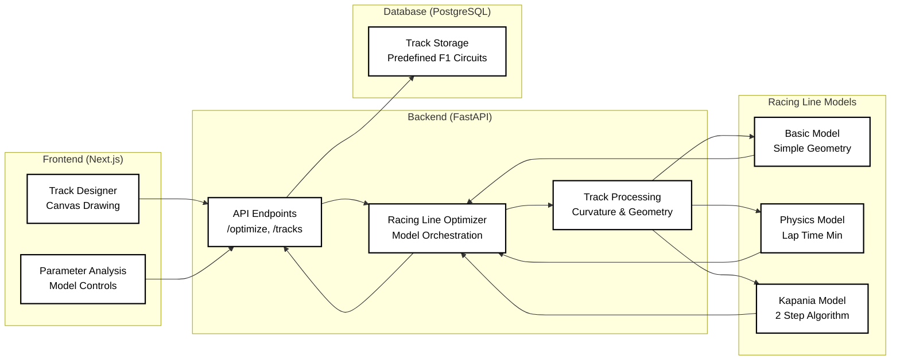
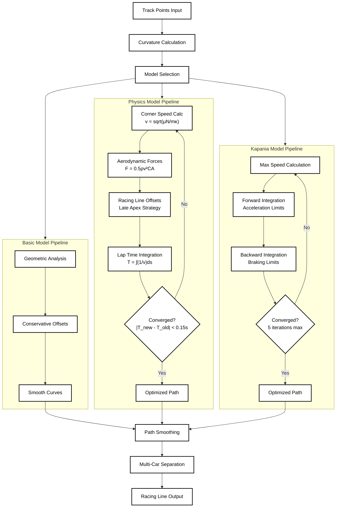

# Mathematical Modelling of Race Lines

A research-grade racing line optimization platform implementing three mathematical models for F1 trajectory planning. Built with Next.js frontend and FastAPI backend.

## Table of Contents

- [System Architecture](#system-architecture)
- [Racing Line Models](#racing-line-models)
- [Model Processing Pipeline](#model-processing-pipeline)
- [Quick Start](#quick-start)
  - [Prerequisites](#prerequisites)
  - [Installation](#installation)
  - [Development](#development)
- [Technical Stack](#technical-stack)
- [Model Comparison](#model-comparison)
- [Key Equations](#key-equations)
- [Documentation](#documentation)
- [Project Demo](#project-demo)
- [Contact & Credits](#contact--credits)


## Repository Structure

<details>
<summary>📁 Project Structure (Click to expand)</summary>

```
project-maths-modelling-project-sarosh-farhan/
├── Backend/                          # FastAPI Backend
│   ├── data/
│   │   └── track_data.py            # Sample F1 track data
│   ├── schemas/
│   │   ├── track.py                 # Database models & Pydantic schemas
│   │   └── response.py              # API response models
│   ├── simulation/
│   │   ├── algorithms/              # Racing line models
│   │   │   ├── base_model.py        # Abstract base class
│   │   │   ├── basic_model.py       # Simple geometric model
│   │   │   ├── physics_model.py     # Physics-based optimization
│   │   │   └── kapania_model.py     # Two-step algorithm
│   │   ├── aerodynamics.py          # Aerodynamic calculations
│   │   ├── curvilinear_coordinates.py # Track geometry
│   │   └── optimizer.py             # Main optimization orchestrator
│   ├── tests/                       # Testing & analysis
│   │   ├── models/
│   │   │   └── advanced_analysis_results/ # Research outputs
│   │   └── demo_kapania_analysis.py
│   ├── database.py                  # PostgreSQL connection
│   ├── main.py                      # FastAPI application
│   └── requirements.txt             # Python dependencies
├── frontend/                        # Next.js Frontend
│   ├── src/
│   │   ├── app/
│   │   │   ├── page.tsx            # Main application
│   │   │   ├── track-designer/      # Track drawing interface
│   │   │   └── parameter-analysis/  # Model controls
│   │   ├── components/
│   │   │   ├── CanvasDrawPaper.tsx  # Paper.js canvas
│   │   │   ├── TrackControl.tsx     # Track parameters
│   │   │   ├── CarControl.tsx       # Vehicle settings
│   │   │   └── ParameterAnalysis.tsx # Model selection
│   │   ├── lib/
│   │   │   └── dataStore.ts         # State management
│   │   └── types/
│   │       └── index.ts             # TypeScript definitions
│   ├── package.json                 # Node.js dependencies
│   └── next.config.ts               # Next.js configuration
├── docs/                            # Documentation
│   ├── models/
│   │   ├── poster/                  # Research presentation
│   │   │   ├── poster.md           # Academic documentation
│   │   │   ├── poster.ipynb        # Jupyter notebook
│   │   │   └── images/             # Generated visualizations
│   │   ├── physics-based-model.md  # Physics model docs
│   │   └── kapania-two-step-algorithm.md # Kapania docs
│   ├── demo/
│   │   └── physics-based/          # Component demonstrations
│   │       ├── 01_corner_speed_calculation.py
│   │       ├── 02_straight_speed_calculation.py
│   │       ├── 03_late_apex_strategy.py
│   │       ├── 04_lap_optimization.py
│   │       └── 05_complete_physics_integration.py
│   └── backend-flow-diagram.md     # System architecture
└── README.md                       # This file
```

</details>

## System Architecture



## Model Processing Pipeline



## Quick Start

### Prerequisites
- Node.js 18+
- Python 3.8+
- npm 8+

### Installation
```bash
# Clone repository
git clone <repo-url>
cd <repo-url>

# Frontend setup
cd frontend && npm install

# Backend setup  
cd ../Backend
python -m venv venv
source venv/bin/activate  # Windows: venv\Scripts\activate
pip install -r requirements.txt
```

### Development
```bash
# Terminal 1: Frontend
cd frontend && npm run dev

# Terminal 2: Backend
cd Backend && uvicorn main:app --reload --port 8000
```

Access: http://localhost:3000

## Technical Stack

| Component | Technology | Purpose |
|-----------|------------|---------|
| Frontend | Next.js 14, React, TypeScript | Interactive track designer |
| Backend | FastAPI, Python 3.8+ | Racing line optimization API |
| Database | PostgreSQL | F1 track data storage |
| UI Framework | Tailwind CSS | Modern responsive design |
| Canvas | Paper.js | Interactive track drawing |
| Math/Science | NumPy, SciPy | Physics calculations |
| Optimization | Iterative algorithms | Lap time minimization |


## Documentation

- **Models**: `/docs/models/` - Mathematical documentation
- **Demo Scripts**: `/docs/demo/physics-based/` - Component visualizations
- **Poster**: `/docs/models/poster/` - Research presentation materials

---

## Images

**Include Images**


## Contact & Credits
- Created by Joel Thomas Chacko (24220504) and Sarosh Farhan.
- For questions, suggestions, or contributions, please open an issue or pull request.
