# Backend Physics Simulation Flow Diagram

**Complete F1 Racing Line Optimization Backend Architecture**

This document provides a detailed visual representation of how the backend processes simulation requests, from API endpoint to physics calculations and response generation.

---

## System Overview

The backend implements a sophisticated physics-based racing line optimization system with the following key components:

- **API Layer**: FastAPI endpoints for simulation requests
- **Model Architecture**: Pluggable racing line calculation models
- **Physics Engine**: Advanced vehicle dynamics with speed-dependent aerodynamics
- **Coordinate Systems**: Fully integrated curvilinear coordinate framework with true research paper compliance
- **Optimization**: Speed profile calculation and lap time optimization

---

## Complete Backend Flow Diagram

The following diagram shows the complete request-to-response flow in the backend, highlighting the new speed-dependent aerodynamics and physics calculations:

```mermaid
graph TD
    %% === API LAYER ===
    A["`🌐 **Frontend Request**
    POST /simulate
    {track_points, cars, width, friction, model}`"] --> B["`📥 **main.py**
    SimulationRequest validation
    Convert to Track object`"]
    
    B --> C{"`🔧 **Model Selection**
    physics_based vs basic`"}
    
    %% === MODEL ROUTING ===
    C -->|physics_based| D["`🔬 **optimizer.py**
    optimize_racing_line()`"]
    C -->|basic| E["`⚡ **Basic Model**
    Simple geometric calculation`"]
    
    %% === PHYSICS-BASED FLOW (MAIN PATH) ===
    D --> F["`🏗️ **Model Factory**
    PhysicsBasedModel.calculate_racing_line()`"]
    
    F --> G["`📊 **Track Processing**
    • Extract track points & curvature
    • Calculate track vectors
    • Parse car parameters`"]
    
    G --> H["`🔥 **SPEED-DEPENDENT AERODYNAMICS**
    aerodynamics.py`"]
    
    %% === AERODYNAMICS SUBSYSTEM ===
    H --> I["`📈 **Research Paper Data**
    speed_points: [0,20,40,60,80,100] m/s
    drag_coeffs: [1.0,1.2,1.4,1.6,1.8,2.0]
    lift_coeffs: [0.5,1.5,2.5,3.2,3.7,4.0]
    cop: [2.5,2.6,2.7,2.8,2.9,3.0] m`"]
    
    I --> J["`🧮 **Cubic Interpolation**
    get_speed_dependent_coefficients(v)
    → CD(v), CL(v), CoP(v)`"]
    
    J --> K["`⚡ **Force Calculation**
    drag_force = 0.5×ρ×CD(v)×A×v²
    downforce = 0.5×ρ×CL(v)×A×v²`"]
    
    %% === SPEED CALCULATION ENGINE ===
    K --> L["`🎯 **Speed Calculation Loop**
    calculate_max_cornering_speeds()
    FOR each track point:`"]
    
    L --> M["`🔄 **5-Iteration Convergence**
    Initial guess: v = 30-60 m/s
    ITERATE 5 times:`"]
    
    M --> N{"`🛣️ **Track Section Type**
    Corner vs Straight?`"}
    
    %% === CORNER PHYSICS ===
    N -->|Corner| O["`🌀 **Corner Physics**
    1. Get CD(v), CL(v) at current speed
    2. Calculate downforce
    3. Total grip = μ×(mg + downforce)
    4. v_max = √(grip/(m×κ))`"]
    
    %% === STRAIGHT PHYSICS ===
    N -->|Straight| P["`🏁 **Straight Physics**
    1. Get CD(v) at current speed
    2. Calculate drag force
    3. Max drive force = m×accel×0.8
    4. If drag > drive → reduce speed
    5. Solve drag_limited_speed()`"]
    
    %% === CONVERGENCE CHECK ===
    O --> Q{"`✅ **Convergence Check**
    |v_new - v_old| < 0.3 m/s?`"}
    P --> Q
    
    Q -->|No| M
    Q -->|Yes| R["`📝 **Store Speed**
    max_speeds[i] = converged_speed`"]
    
    %% === RACING LINE OPTIMIZATION ===
    R --> S["`🏎️ **Racing Line Offsets**
    _calculate_physics_based_offsets()
    Based on speed-dependent performance`"]
    
    S --> T["`📐 **Geometric Application**
    Apply offsets to track centerline
    Stay within track boundaries
    Apply smoothing`"]
    
    %% === SPEED PROFILE GENERATION ===
    T --> U["`📊 **Speed Profile**
    calculate_speed_profile()
    Apply speed limits to racing line`"]
    
    U --> V["`⏱️ **Lap Time Calculation**
    lap_time = Σ(segment_length / speed)
    FOR each racing line segment`"]
    
    %% === CURVILINEAR COORDINATE SYSTEM (FULLY INTEGRATED) ===
    S --> CURVILINEAR["`🗺️ **CURVILINEAR COORDINATES**
    (Fully Integrated & Active)`"]
    
    CURVILINEAR --> W["`📍 **CurvilinearCoordinateSystem**
    • Generate racing line in (s,n) coordinates
    • Distance-based calculations (s as independent variable)
    • True research paper compliance
    • Convert to (x,y) only for frontend`"]
    
    W --> W2["`🧮 **Track-Relative Physics**
    • Enhanced curvature calculation
    • Track geometry (tangent/normal vectors)
    • Kinematic equations (1-6) implemented
    • Coordinate transformations working`"]
    
    W2 --> T
    
    %% === RESPONSE GENERATION ===
    V --> X["`📋 **Result Assembly**
    Create racing line data:
    • Optimized coordinates
    • Speed profile
    • Lap time
    • Car-specific results`"]
    
    X --> Y["`📤 **API Response**
    SimulationResponse
    optimal_lines: [...]
    Return to frontend`"]
    
    %% === STYLING ===
    classDef apiLayer fill:#e1f5fe,stroke:#01579b,stroke-width:2px
    classDef physicsCore fill:#f3e5f5,stroke:#4a148c,stroke-width:2px
    classDef aeroSystem fill:#fff3e0,stroke:#e65100,stroke-width:2px
    classDef speedCalc fill:#e8f5e8,stroke:#1b5e20,stroke-width:2px
    classDef racingLine fill:#fff8e1,stroke:#f57f17,stroke-width:2px
    classDef curvilinear fill:#fce4ec,stroke:#880e4f,stroke-width:2px
    
    class A,B,Y apiLayer
    class D,F,G physicsCore
    class H,I,J,K aeroSystem
    class L,M,N,O,P,Q,R speedCalc
    class S,T,U,V,X racingLine
    class W curvilinear
```

---

## Detailed Component Breakdown

### 🔥 Speed-Dependent Aerodynamics System

The aerodynamics system is the heart of the new physics implementation:

```mermaid
graph LR
    A["`**Input Speed**
    v = 60 m/s`"] --> B["`**Research Paper Data**
    speed_points: [0,20,40,60,80,100]
    drag_coeffs: [1.0,1.2,1.4,1.6,1.8,2.0]
    lift_coeffs: [0.5,1.5,2.5,3.2,3.7,4.0]`"]
    
    B --> C["`**Cubic Interpolation**
    At 60 m/s:
    CD = 1.6
    CL = 3.2
    CoP = 2.8m`"]
    
    C --> D["`**Car Customization**
    effective_CD = 1.6 × (base_CD/1.0)
    effective_CL = 3.2 × (base_CL/3.0)`"]
    
    D --> E["`**Force Calculation**
    drag = 0.5×ρ×1.6×A×60²
    downforce = 0.5×ρ×3.2×A×60²`"]
    
    E --> F["`**Physics Application**
    Corner: More downforce → higher speeds
    Straight: More drag → speed limited`"]
```

### 🔄 Iterative Speed Convergence

This diagram shows how the system finds the correct speed through iteration:

```mermaid
graph TD
    A["`**Initial Guess**
    Corner: v = 30 m/s
    Straight: v = 60 m/s`"] --> B["`**Get Coefficients**
    CD(v), CL(v) from research data`"]
    
    B --> C{"`**Track Section?**`"}
    
    C -->|Corner| D["`**Corner Calculation**
    1. downforce = 0.5×ρ×CL(v)×A×v²
    2. total_grip = μ×(mg + downforce)
    3. v_new = √(total_grip/(m×κ))`"]
    
    C -->|Straight| E["`**Straight Calculation**
    1. drag = 0.5×ρ×CD(v)×A×v²
    2. max_drive = m×accel×0.8
    3. if drag > drive: solve for v_new
    4. else: maintain/increase speed`"]
    
    D --> F{"`**Converged?**
    |v_new - v_old| < 0.3 m/s?`"}
    E --> F
    
    F -->|No| G["`**Update Speed**
    v = 0.6×v_old + 0.4×v_new
    (damped to prevent oscillation)`"]
    
    G --> B
    
    F -->|Yes| H["`**Final Speed**
    Store converged speed
    Move to next track point`"]
    
    H --> I["`**Apply Physics Scaling**
    mass_penalty = √(750/mass)
    accel_boost = √(accel/10)
    final = speed × penalties × boosts`"]
```

### 🏗️ Module Architecture

This shows how the different backend modules interact:

```mermaid
graph TB
    subgraph API["🌐 API Layer"]
        MAIN["`**main.py**
        FastAPI endpoints
        Request validation
        Response formatting`"]
    end
    
    subgraph CORE["🔬 Physics Core"]
        OPT["`**optimizer.py**
        • optimize_racing_line()
        • calculate_speed_profile()
        • Model orchestration`"]
        
        PHYS["`**physics_model.py**
        • calculate_racing_line()
        • max_cornering_speeds()
        • physics_based_offsets()`"]
        
        BASE["`**base_model.py**
        • Abstract base class
        • Common utilities
        • Smoothing functions`"]
    end
    
    subgraph AERO["🔥 Aerodynamics"]
        AERO_MOD["`**aerodynamics.py**
        • AerodynamicModel class
        • Speed-dependent coefficients
        • Force calculations
        • Research paper data`"]
    end
    
    subgraph COORD["🗺️ Coordinates"]
        CURV["`**curvilinear_coordinates.py**
        • CurvilinearCoordinateSystem
        • Track geometry calculation
        • Kinematic equations
        • Coordinate transformations`"]
    end
    
    subgraph SCHEMA["📋 Data Models"]
        TRACK["`**schemas/track.py**
        • Car model
        • Track model
        • TrackPoint model
        • Validation rules`"]
    end
    
    %% Connections
    MAIN --> OPT
    OPT --> PHYS
    PHYS --> BASE
    PHYS --> AERO_MOD
    PHYS -.-> CURV
    OPT --> TRACK
    PHYS --> TRACK
    
    %% Styling
    classDef apiStyle fill:#e3f2fd,stroke:#1976d2,stroke-width:2px
    classDef coreStyle fill:#f3e5f5,stroke:#7b1fa2,stroke-width:2px
    classDef aeroStyle fill:#fff3e0,stroke:#f57c00,stroke-width:2px
    classDef coordStyle fill:#e8f5e8,stroke:#388e3c,stroke-width:2px
    classDef schemaStyle fill:#fce4ec,stroke:#c2185b,stroke-width:2px
    
    class API,MAIN apiStyle
    class CORE,OPT,PHYS,BASE coreStyle
    class AERO,AERO_MOD aeroStyle
    class COORD,CURV coordStyle
    class SCHEMA,TRACK schemaStyle
```

---

## 🚀 What Happens During a Simulation Request

### Step-by-Step Flow

1. **Frontend Request** (`POST /simulate`)
   - User creates track in Track Designer
   - Configures car parameters (mass, drag, lift, etc.)
   - Clicks "Run Simulation"

2. **API Processing** (`main.py`)
   - Validates request data
   - Converts JSON to Track and Car objects
   - Selects physics model (usually `physics_based`)

3. **Model Initialization** (`optimizer.py` → `physics_model.py`)
   - Extracts car parameters (mass, drag_coefficient, lift_coefficient, etc.)
   - Calculates track geometry (curvature, vectors)
   - Initializes aerodynamics system

4. **Speed-Dependent Aerodynamics** (`aerodynamics.py`)
   - For each track point, iteratively calculates:
   - Gets research paper coefficients CD(v), CL(v) at current speed
   - Applies car's base coefficients as scaling factors
   - Calculates aerodynamic forces

5. **Physics Calculations**
   - **Corners**: Downforce enhances grip → higher cornering speeds
   - **Straights**: Drag limits top speed → realistic acceleration curves
   - **Convergence**: 5 iterations to find accurate speed

6. **Racing Line Optimization**
   - Uses calculated speeds to determine optimal track positioning
   - Applies late-apex strategy based on physics
   - Smooths final racing line

7. **Response Generation**
   - Calculates lap time from speed profile
   - Assembles racing line coordinates
   - Returns to frontend for visualization

---

## 🔧 Key Implementation Details

### Research Paper Compliance

The system implements **exact data from Oxford research paper Figure 4**:

| Speed (m/s) | CD (Drag) | CL (Downforce) | Center of Pressure (m) |
|-------------|-----------|----------------|------------------------|
| 0           | 1.0       | 0.5            | 2.5                    |
| 20          | 1.2       | 1.5            | 2.6                    |
| 40          | 1.4       | 2.5            | 2.7                    |
| 60          | 1.6       | 3.2            | 2.8                    |
| 80          | 1.8       | 3.7            | 2.9                    |
| 100         | 2.0       | 4.0            | 3.0                    |

### Physics Accuracy

- **Cornering Physics**: `v_max = √[(μ × (mg + downforce)) / (m × κ)]`
- **Drag-Limited Speed**: Solves `F_drag = F_drive` iteratively
- **Mass Effects**: Heavier cars properly penalized
- **Acceleration Scaling**: Better acceleration = higher cornering speeds

### Current Status

- ✅ **Speed-dependent aerodynamics**: Fully implemented with research paper data
- ✅ **Drag force integration**: Complete with drag-limited speed calculations
- ✅ **Curvilinear coordinates**: **FULLY INTEGRATED** - True research paper compliance achieved
- ✅ **Clean production backend**: All debug statements removed, professional logging only
- ✅ **Distance-based calculations**: Racing line generated in (s,n) coordinates
- ⏳ **3-DOF dynamics**: Next major milestone
- ⏳ **Load transfer**: Future enhancement

---

## 🎯 Understanding the Current Flow

**When you run a simulation now:**

1. Your car parameters (drag/lift coefficients) are **properly used**
2. **Real F1-like aerodynamics** affect performance at different speeds
3. **Drag limits top speed** on straights realistically
4. **Downforce enhances cornering** at high speeds
5. **Racing line calculated in curvilinear coordinates** for research accuracy
6. **Clean, professional output** without debug clutter

### 🏭 Production-Ready Features

- **Clean Logging**: Essential information only, no debug noise
- **Fast Execution**: Optimized performance without verbose output
- **Professional Output**: Production-ready console messages
- **Research-Grade Data**: Access to pure curvilinear racing line data
- **Maintainable Code**: Clean, focused codebase

### 🎯 Evolution Summary

**The system has evolved from:**
- ❌ Fixed coefficients with unrealistic behavior
- ❌ Basic point-mass physics
- ❌ Cartesian-only calculations
- ❌ Debug-cluttered output

**To:**
- ✅ **Research-grade speed-dependent physics** with realistic F1 behavior
- ✅ **True curvilinear coordinate system** compliance
- ✅ **Production-ready clean backend**
- ✅ **Distance-based calculations** with proper track-relative dynamics

**This is now a professional-level foundation** ready for advanced features like full 3-DOF dynamics and optimal control!
