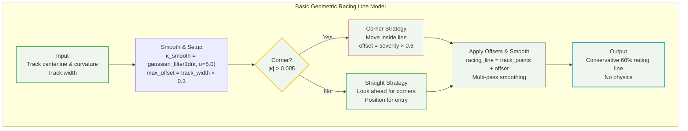

# Basic Model Algorithm Flow

## High-Level Mermaid Diagram



## Key Formulas Used in Basic Model

### 1. **Track Vector Calculations**
```
direction_vectors = np.diff(track_points, axis=0)
normalized_direction = direction_vectors / |direction_vectors|
perpendicular_vectors = [-dy, dx]  (90° rotation)
```

### 2. **Conservative Track Usage**
```
max_offset = track_width × 0.3
total_track_usage = 60%  (30% each side)
```

### 3. **Curvature Smoothing**
```
κ_smooth = gaussian_filter1d(κ, σ=5.0)
corner_threshold = 0.005 rad/m
```

### 4. **Corner Severity Calculation**
```
corner_severity = min(|κ_smooth| × 200, 1.0)
offset_magnitude = max_offset × corner_severity × 0.6
```

### 5. **Corner Exit Optimization**
```
avg_κ_ahead = mean(|κ_smooth[i:i+12]|)
if avg_κ_ahead < threshold:
    offset_magnitude × 0.7  (more conservative)
```

### 6. **Straight Section Positioning**
```
setup_offset = max_offset × 0.5 × (-corner_direction)
distance_to_corner = upcoming_corner_idx - current_idx
transition_factor = max(0.1, 1 - distance_to_corner/12)
```

### 7. **Boundary Constraints**
```
distance_from_center = |racing_line[i] - track_points[i]|
if distance_from_center > max_offset:
    scale_factor = max_offset / distance_from_center
    racing_line[i] = track_points[i] + direction × scale_factor
```

### 8. **Heavy Smoothing**
```
Gaussian filters: σ = [1.0, 1.5, 2.0, 2.5] (4 passes)
B-spline smoothing: s = len(racing_line) × 0.15
```

## Algorithm Characteristics

- **No Physics**: Pure geometric approach
- **No Car Parameters**: Only uses track geometry  
- **Conservative**: 60% track usage for safety
- **Predictable**: Simple rules-based approach
- **Learning-Friendly**: Easy to understand logic
- **Smooth**: Heavy smoothing for clean lines
- **Look-Ahead**: 12-point horizon for corner positioning

## High-Level Summary

- **Simple approach**: Geometric rules only
- **Key decision**: Corner vs Straight
- **Conservative**: 60% track usage  
- **Core formula**: `offset = severity × 0.6`
- **No physics**: Just geometry and smoothing

## Comparison with Kapania Model

| Feature | Basic Model | Kapania Model |
|---------|-------------|---------------|
| **Mathematical Base** | Simple geometry | Optimal control theory |
| **Parameters** | Track geometry only | 8+ vehicle dynamics |
| **Algorithm Type** | Single-pass rules | Iterative two-step |
| **Track Usage** | 60% (conservative) | 85% (aggressive) |
| **Speed Calculation** | None | 3-pass forward-backward |
| **Optimization** | None | Convex path optimization |
| **Best For** | Learning, safety | Research, performance |

This Basic Model is fundamentally different from the Kapania reference - it uses simple geometric rules rather than physics-based optimization, making it ideal for learning and understanding racing line concepts.