# Physics Model Algorithm Flow

## High-Level Physics-Based Racing Line Mermaid Diagram

```mermaid
%%{init: {"flowchart": {"htmlLabels": false}} }%%
flowchart TD
    subgraph "Physics-Based Racing Line Model"
        
        A["Input & Setup
        track_points, track_width, car_params
        M=1500kg, a_max=5.0m/s², C_D=1.0, C_L=3.0
        A = L×W×0.7, MAX_ITERATIONS=4, CONVERGENCE=0.15s"] --> B["Create Curvilinear System
        coord_system = create_curvilinear_system(track_points, track_width/2)
        θ(s) = arctan2(tangent_y, tangent_x)
        κ(s) = dθ/ds with central difference
        κ = gaussian_filter1d(κ, σ=1.0)"]
        
        B --> C["Physics Speed Calculation
        Corner: v = √(μ×(M×g+F_downforce)/(M×|κ|))
        F_downforce = 0.5×ρ×v²×C_L×A (iterative)
        Straight: F_drive = M×a_max = F_drag"]
        
        C --> D["Late Apex Strategy
        max_offset = track_width × 0.4
        speed_factor: 1.0(slow) | 0.8(med) | 0.6(fast)
        phase_factor: 0.9(apex) | -0.7(entry) | -0.6(exit)"]
        
        D --> E["Generate Racing Line
        offset = max_offset × phase_factor × speed_factor
        corner_direction = -sign(κ)
        racing_line = track_points + offset × perpendicular"]
        
        E --> F["Calculate Lap Time
        T_lap = Σ(distance_i / speed_i)
        Objective: minimize T_lap"]
        
        F --> G{"Converged?
        |T_new - T_old| < 0.15s"}
        
        G -->|No| H["Optimize Path Geometry
        Update racing line
        iteration++"]
        
        H --> B
        
        G -->|Yes| I["Output
        Optimized 80% racing line
        Physics-based speeds
        Minimized lap time"]
        
    end
    
    style A fill:#E8F5E8,stroke:#4CAF50,stroke-width:2px
    style C fill:#FFF3E0,stroke:#FF9800,stroke-width:2px  
    style D fill:#E3F2FD,stroke:#2196F3,stroke-width:2px
    style G fill:#FFEBEE,stroke:#F44336,stroke-width:2px
    style I fill:#E8F5E8,stroke:#4CAF50,stroke-width:3px
```



## Key Formulas by Section

### **Speed Calculations**
```
Corner Speed (Iterative):
v_estimate = 30.0
for i in range(3):
    F_downforce = 0.5 × ρ × v² × C_L × A
    N = M × g + F_downforce  
    F_lateral = μ × N
    v_new = √(F_lateral / (M × |κ|))
    if |v_new - v_estimate| < 0.5: break
    v_estimate = 0.7 × v_estimate + 0.3 × v_new

Straight Speed:
F_drive = M × a_max
v_max = drag_limited_speed(F_drive, A, C_D)
```

### **Late Apex Strategy**
```
Speed Categories:
if v < 30: speed_factor = 1.0
elif v < 50: speed_factor = 0.8  
else: speed_factor = 0.6

Corner Phases:
Apex: phase_factor = 0.9 × speed_factor
Entry: phase_factor = -0.7 × speed_factor
Exit: phase_factor = -0.6 × speed_factor

Braking Distance:
d_brake = v² / (2 × a_max)
```

### **Racing Line Generation**
```
Offset Calculation:
offset = max_offset × phase_factor × corner_direction
corner_direction = -sign(κ)
max_offset = track_width × 0.4

Line Application:
tangent = normalized(points_i+1 - points_i-1)
perpendicular = [-tangent_y, tangent_x]
racing_line_i = track_points_i + offset_i × perpendicular
```

### **Lap Time Optimization**
```
Objective Function:
T_lap = Σ(distance_i / speed_i)

Distance Calculation:
distance_i = √((x_i+1-x_i)² + (y_i+1-y_i)²)

Convergence Check:
if |T_new - T_old| < 0.15: converged = True
```

## Legend

### **Mathematical Symbols**
| Symbol | Description | Units |
|--------|-------------|-------|
| **κ** | Track curvature | rad/m |
| **v** | Vehicle speed | m/s |
| **M** | Vehicle mass | kg |
| **g** | Gravitational acceleration (9.81) | m/s² |
| **μ** | Friction coefficient | - |
| **ρ** | Air density (1.225) | kg/m³ |
| **A** | Frontal area | m² |
| **C_D** | Drag coefficient | - |
| **C_L** | Lift coefficient | - |
| **F** | Force | N |
| **T** | Time | s |
| **i** | Point index along track | - |

### **Algorithm Parameters**
| Parameter | Value | Description |
|-----------|-------|-------------|
| **MAX_ITERATIONS** | 4 | Maximum optimization loops |
| **CONVERGENCE** | 0.15s | Lap time convergence threshold |
| **track_width × 0.4** | 80% usage | Maximum track usage (40% each side) |
| **Corner threshold** | \|κ\| > 0.003 | Curvature limit for corner detection |
| **Speed limits** | 5.0 - 100.0 m/s | Minimum and maximum allowed speeds |

### **Speed Category Factors**
| Speed Range | Factor | Strategy |
|-------------|--------|----------|
| **v < 30 m/s** | 1.0 | Slow corners - maximize radius |
| **30 ≤ v < 50 m/s** | 0.8 | Medium corners - balanced approach |
| **v ≥ 50 m/s** | 0.6 | Fast corners - minimize radius |

### **Corner Phase Factors**
| Phase | Factor | Racing Strategy |
|-------|--------|-----------------|
| **Apex** | 0.9 × speed_factor | Late apex positioning |
| **Entry** | -0.7 × speed_factor | Go wide for setup |
| **Exit** | -0.6 × speed_factor | Accelerate out wide |

### **Diagram Color Coding**
| Color | Section | Purpose |
|-------|---------|---------|
| 🟢 **Green** | Input/Output | Data flow endpoints |
| 🟠 **Orange** | Physics Calculations | Speed and force computations |
| 🔵 **Blue** | Racing Strategy | Late apex and positioning logic |
| 🔴 **Red** | Decision Points | Convergence and conditional checks |

This high-level diagram shows the **core algorithm flow** with **proper subscript notation** and **complete mathematical documentation**! 🏎️