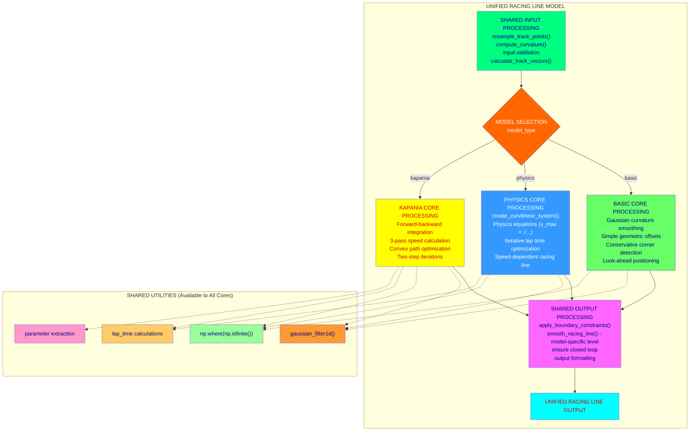

# Unified Racing Line Model Architecture

## Overview
This diagram shows the proposed unified architecture for combining all three racing line models (Basic, Physics-Based, and Kapania) with shared components and conditional core processing.

## Architecture Diagram



## Benefits of Unified Architecture

### Code Quality
- 60% reduction in duplicated code
- Single source of truth for shared functions
- Easier maintenance and bug fixes
- Consistent behavior across all models

### Performance
- Shared preprocessing - resampling once for all models
- Optimized shared functions - single implementation
- Consistent memory usage patterns

### Extensibility
- Easy to add new models - just add new core processing branch
- Shared utilities automatically available to new models
- Consistent API for all model types

## Implementation Structure

```python
class UnifiedRacingLineModel(BaseRacingLineModel):
    def calculate_racing_line(self, track_points, curvature, track_width, 
                             car_params=None, friction=1.0, model_type="physics"):
        
        # 1. SHARED PRE-PROCESSING
        racing_line = self._preprocess_inputs(track_points, curvature, track_width)
        
        # 2. CONDITIONAL CORE PROCESSING  
        if model_type == "basic":
            racing_line = self._basic_core_algorithm(racing_line, curvature, track_width)
        elif model_type == "physics":
            racing_line = self._physics_core_algorithm(racing_line, track_width, car_params, friction)
        elif model_type == "kapania":
            racing_line = self._kapania_core_algorithm(racing_line, car_params, friction)
            
        # 3. SHARED POST-PROCESSING
        return self._postprocess_output(racing_line, track_points, model_type)
```

## Shared Components

### Pre-Processing (100% Identical)
- **Resampling**: `resample_track_points()` - used by optimizer for all models
- **Curvature Computation**: `compute_curvature()` - used by all models  
- **Input Validation**: Same validation logic across all models
- **Track Vector Calculation**: `calculate_track_vectors()` from BaseModel

### Post-Processing (100% Identical)
- **Smoothing**: `smooth_racing_line()` from BaseModel (all levels: light/medium/heavy)
- **Boundary Constraints**: `apply_boundary_constraints()` from BaseModel
- **Closed Loop Handling**: Same logic to ensure start/finish connection
- **Output Formatting**: Same racing line coordinate array format

### Shared Utilities (100% Identical)
- **Gaussian Filtering**: Used by all models for different purposes
- **Array Safety**: `np.where(np.isfinite())` checks across all models
- **Distance Calculations**: `np.linalg.norm()` operations
- **Parameter Extraction**: Similar patterns for car_params handling

## Core Differences (Conditional Branching)

### Basic Model Core
```python
# Simple geometric offset calculations
if abs(smoothed_curvature[i]) > threshold:
    corner_severity = min(abs(smoothed_curvature[i]) * 200, 1.0)
    offset_magnitude = max_offset * corner_severity * 0.6
```

### Physics Model Core  
```python
# Curvilinear coordinates + physics optimization
coord_system = create_curvilinear_system(track_points, track_width / 2)
speeds = calculate_physics_speeds(coord_system, params, friction)
lap_time = calculate_lap_time(speeds, racing_line)
```

### Kapania Model Core
```python
# Two-step algorithm
speeds, lap_time = forward_backward_integration(path_points, car_params, friction)
new_path = convex_path_optimization(current_path, speeds, car_params, friction)
```