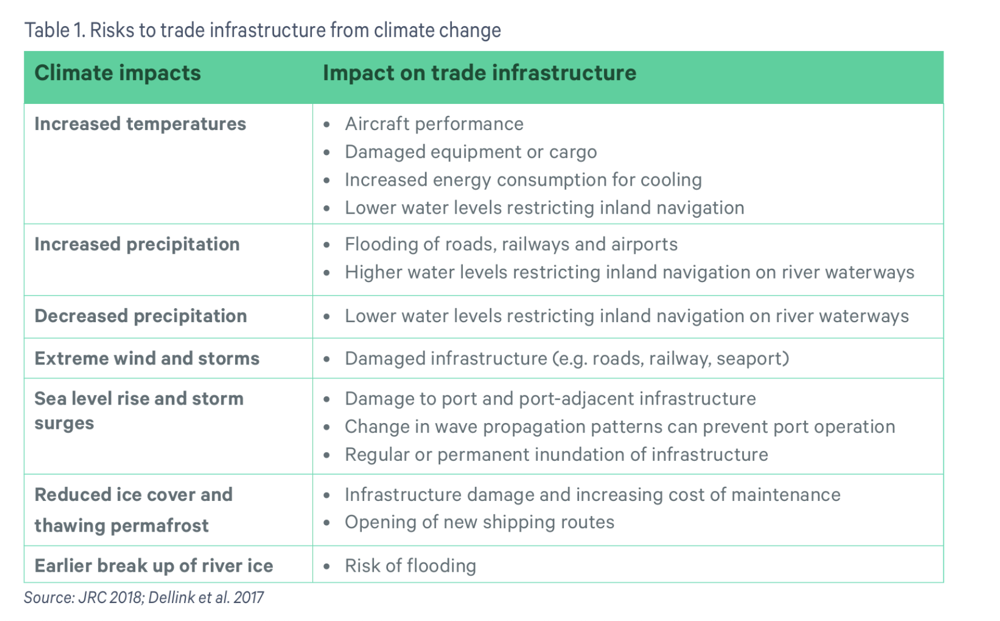
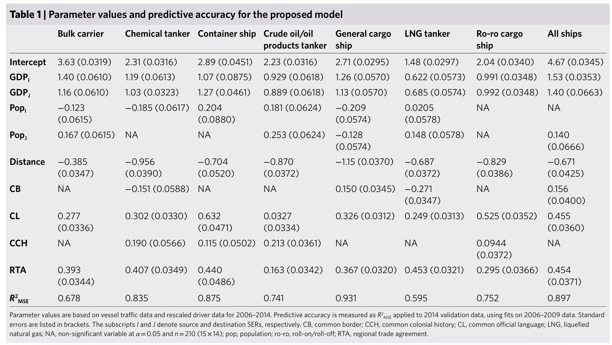

# Researching on ideas that we discussed on 14/05/2025

## 1. Video indexing/searching with the help of AI

The videos are not time stamped by the uploader(as seen on youtube) AI learns the context of the video and saves some info about a particialr frame so that when a user searches for something the AI can then fetch the indexed hash that matched the search description and shows the time stamp from where in the video a particular scene actually starts or the info the user has asked starts.
e.g User types - Slow motion video of a man shooting prince Rupert's drop
results - smartereveryday channel's video on prince Rupert's drop

*How will this learn context from a video* - need to look into researches that are being done on this to see if there are papers written on extracting context from a video maybe going frame by frame or processing the whole video at one go.

## 2. Weather pattern modelling to predict next 15-20 days of weather and suggest optimized routes for high priority goods(grains, food raw materians, medical equipments, drugs) to be imported/exported via air or water in such a way that it takes less time and fuel(inter continental logistics)

Weather pattern changes as told by James in his class for uncertainty quantification are very chaotic and unpredictable, so we will tackle that (doesn't need to be super accurate just enough to predict with good accuracy for the future)

With this done let us say Fedex wants to deliver a package from Dublin to India in optimal time with optimal route.
What we suggest from the weather pattern changes are what routes will be optimal(just like Google maps does on a local level) but we suggest travel time by air, sea

*Resources and research papers*

https://www.gtap.agecon.purdue.edu/ - The Global Trade Analysis Project (GTAP) is a global network of researchers and policy makers conducting quantitative analysis of international policy issues. GTAP is coordinated by the Center for Global Trade Analysis in Purdue University's Department of Agricultural Economics.
The database is not free, we need to look into other data sources

https://www.sei.org/wp-content/uploads/2023/12/sei2023.064-climate-trade-infrastructure.pdf -  Report on the impact and risks that arise from climate change in the trade routes and infrastructure. In this report they talk aboiut variuos factros that affect land, air and sea trading infra and what measures can be take to fix these

https://www.researchgate.net/publication/390627443_Logistics_in_the_era_of_climate_change_a_review_of_challenges_and_development_opportunities - This article analyzes impact of climate change on the logistics sector and identifies key challenges and opportunities for development in the context of sustainable development.

https://www.researchgate.net/publication/389140448_Weather-Related_Disruptions_in_Transportation_and_Logistics_A_Systematic_Literature_Review_and_a_Policy_Implementation_Roadmap - This is a literature review on the increasing severity of extreme  weather and its impact on transport and logistics sector 

https://leung-lab.github.io/leunglab/articles/Sardain_et_al_Nature_Sust_2019.pdf?utm_source=chatgpt.com - Socioeconomic factors, including population growth, global trade and the worldwide transport of materials, interact with  environmental drivers to determine the sustainability of natural systems. We focus on the global shipping network, which is central to invasive species spread worldwide. We explain 90% of the variation in global shipping traffic and a twofold increase in shipping using basic socioeconomic indicators and a temporal validation set. Combining our model with global economic development scenarios, we project global maritime traffic to increase by 240–1,209% by 2050. Integrating our predictions with global climate change projections and shipping-mediated invasion models, we forecast invasion risk to surge in middle-income countries, particularly in Northeast Asia. Shipping growth will have a far greater effect on marine invasions than climate-driven environmental changes: while climate change might actually decrease the average probability of invasion, the emerging global shipping network could yield a 3- to 20-fold increase in global invasion risk.

This one has various  data  sources and the results of their model that they ran

## 3. Epidemiological forecasting for SARS like viruses

Epidemiological forecasting, also known as epi-forecasting, is the process of predicting the future course of a disease or health condition within a population, often using mathematical models and statistical analysis. It helps understand disease dynamics and market trends, enabling informed decision-making for public health, commercial institutions, and the general public. 

https://pmc.ncbi.nlm.nih.gov/articles/PMC7116954/
Abstract
In this work we propose a simple mathematical model for the analysis of the impact of control measures against an emerging infection, namely, the severe acute respiratory syndrome (SARS). The model provides a testable hypothesis by considering a dynamical equation for the contact parameter, which drops exponentially with time, simulating control measures. We discuss the role of modelling in public health and we analyse the distinction between forecasting and projection models as assessing tools for the estimation of the impact of intervention strategies. The model is applied to the communities of Hong Kong and Toronto (Canada) and it mimics those epidemics with fairly good accuracy. The estimated values for the basic reproduction number, R0, were 1.2 for Hong Kong and 1.32 for Toronto (Canada). The model projects that, in the absence of control, the final number of cases would be 320,000 in Hong Kong and 36,900 in Toronto (Canada). In contrast, with control measures, which reduce the contact rate to about 25% of its initial value, the expected final number of cases is reduced to 1778 in Hong Kong and 226 in Toronto (Canada). Although SARS can be a devastating infection, early recognition, prompt isolation, and appropriate precaution measures, can be very effective to limit its spread.

https://arxiv.org/html/2307.01157 - 
Abstract
This paper proposes a novel approach to predict epidemiological parameters by integrating new real-time signals from various sources of information, such as novel social media-based population density maps and Air Quality data. We implement an ensemble of Convolutional Neural Networks (CNN) models using various data sources and fusion methodology to build robust predictions and simulate several dynamic parameters that could improve the decision-making process for policymakers. Additionally, we used data assimilation to estimate the state of our system from fused CNN predictions. The combination of meteorological signals and social media-based population density maps improved the performance and flexibility of our prediction of the COVID-19 outbreak in London. While the proposed approach outperforms standard models, such as compartmental models traditionally used in disease forecasting (SEIR), generating robust and consistent predictions allows us to increase the stability of our model while increasing its accuracy.

https://cmu-delphi.github.io/delphi-tooling-book/  - 
This is a book we can refer to for more reading and feature selections, this has code examples too.
Catution!!!!!! - This book is still under progress an dthings may change over time as per updates in the field.

https://www.sciencedirect.com/science/article/pii/S1571064524001350
This one does a modeling and feature selections based on BIC and error analysis for a model they prepared for Covid data.

https://researchonline.lshtm.ac.uk/4664035/1/epidimiological%20vs%20meterological%20forecasts%20and%20risk%20assesments.pdf
This one relates weather changing patterns to epidemiological forecasting, an interesting take.

**Note** -- The data need to be good and let us see if we can take data from vilrology department of UCD to ease our work onn data collection.